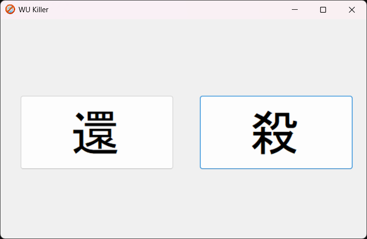

#  WU Killer

Windows Update のコンポーネントを強制的に無効化します。

Force disable Windows Update components.

## ダウンロード / Download

[**ここから / Here**](https://github.com/s1204IT/WU-Killer/releases/latest/download/WU_Killer.exe)

## 使い方 / How to use

- 【還】：再有効化 (Re-enable)
- 【殺】：無効化 (Disable)

## 使用許諾 / License

このプロジェクトは、[**GNU General Public License v3**](LICENSE) の下に基づいてライセンスされています。  
このプロジェクトの成果物を利用して何らかの形で再頒布する場合は、必ずクレジットを記載してください。

This project is licensed under the [**GNU General Public License v3**](LICENSE).  
If you redistribute any work derived from this project in any form, please make sure to give proper credit.
